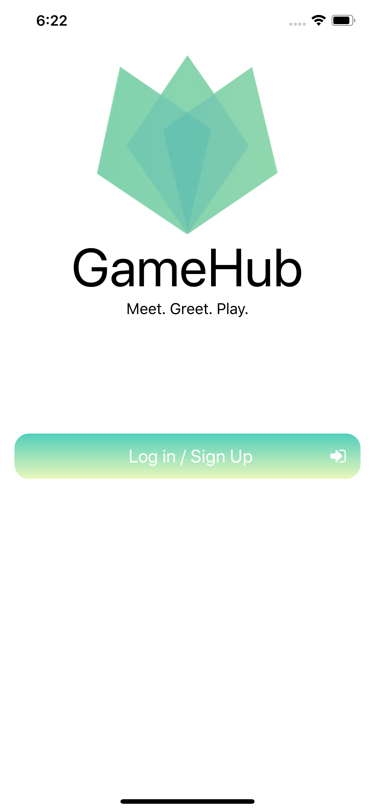
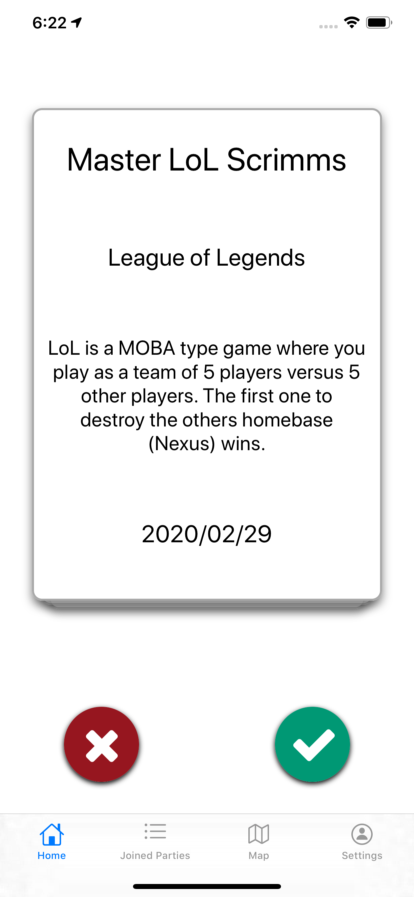
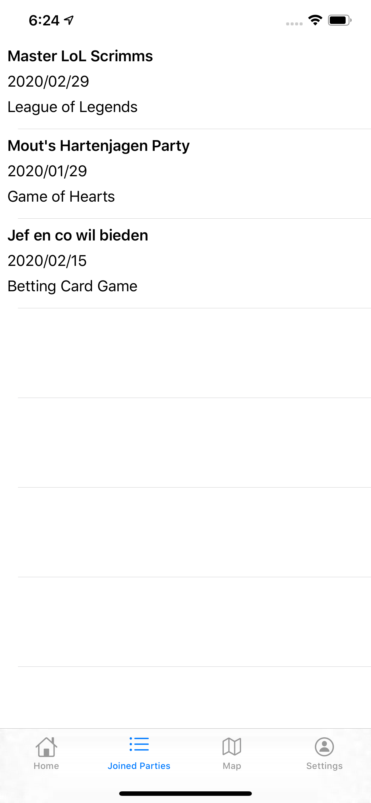
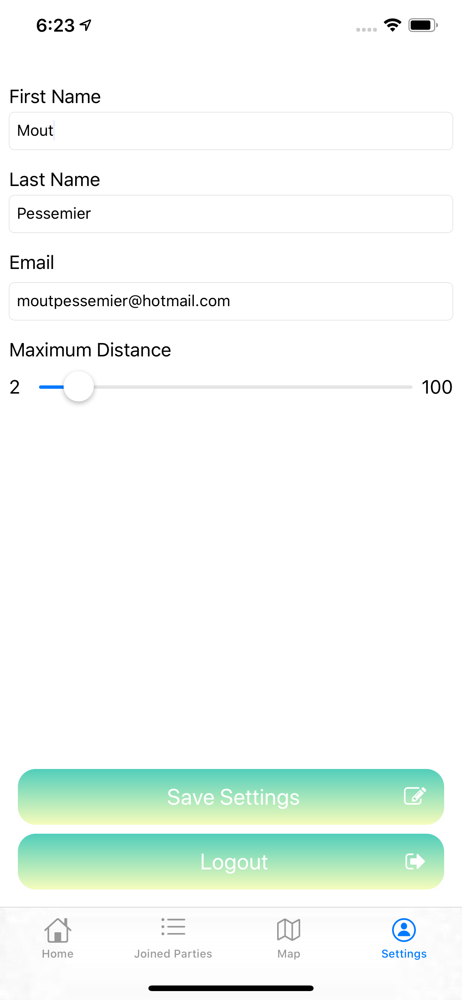

  

<h1 align="center">GameHub</h1>

This app is made for those who like to play (board)games but need others to play with them. As a user you will be able to create a game party to play with others or join an already existing party. In doing so, you will meet new people and have lots of fun!

## Screenshots

  
  
  
  
  

### Test credentials

Email: testuser@hotmail.com

Password: P@ssword1111

## Technologies Used:

 - Frontend: IOS (Swift 5.1, xCode 11)
 - Backend: Node.JS Express api
 - Database: MongoDB (mongoose)

## Links:

 - [Android Frontend](https://github.com/MoutPessemier/GameHub-Android)
 - [Backend](https://github.com/MoutPessemier/GameHub-Backend-Express)
 - [Twitter](https://twitter.com/MoutPessemier)
 - [LinkedIn](https://www.linkedin.com/in/moutpessemier/)

Copyright 2019 © by Mout Pessemier
